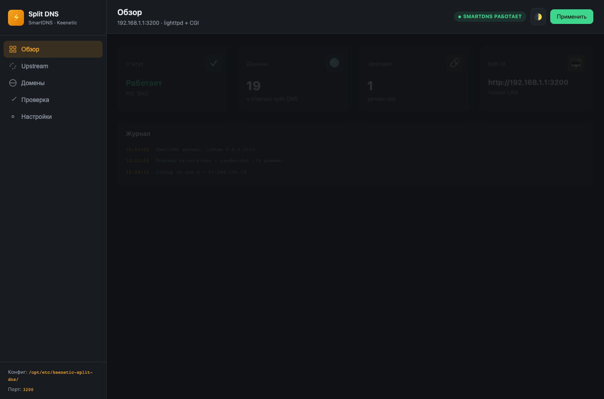
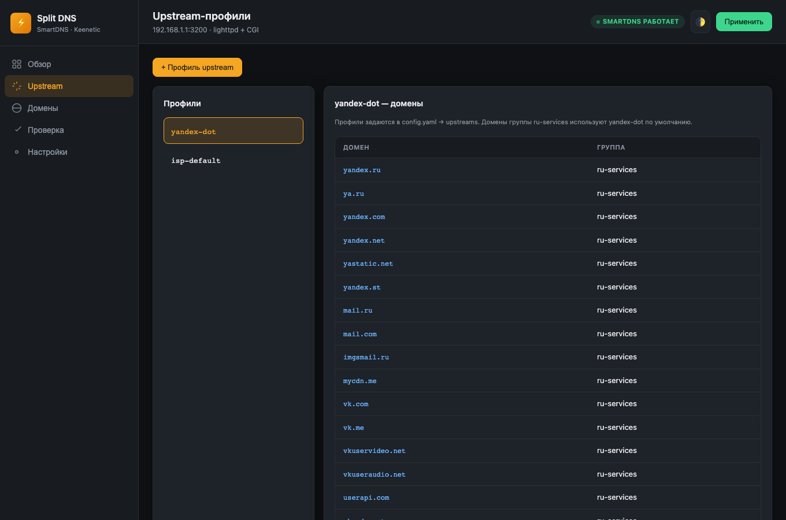
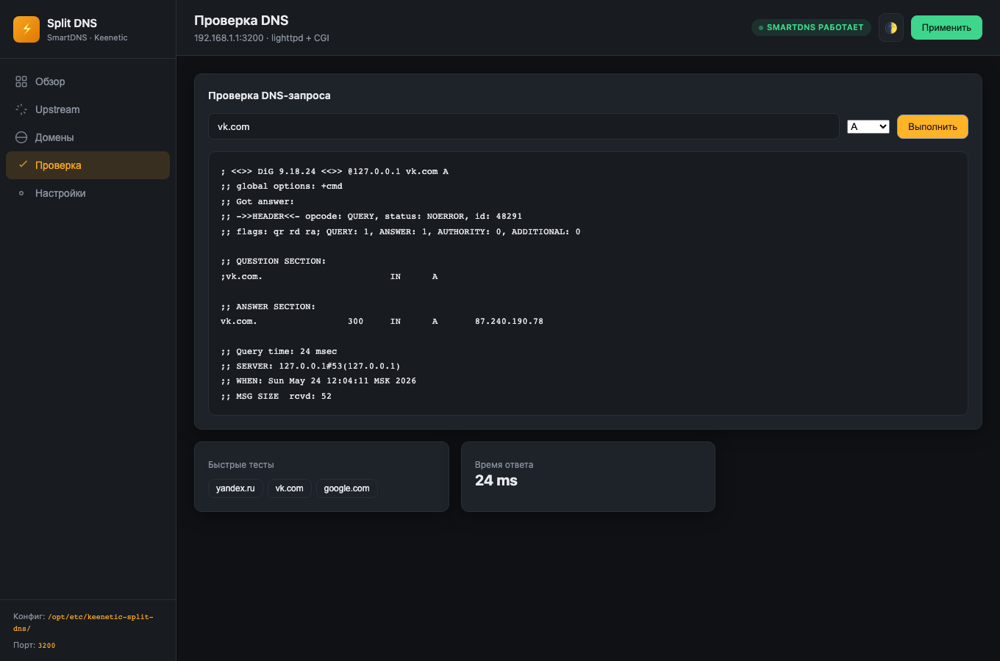

# Keenetic Split DNS

На Keenetic в настройках DNS можно включить **DNS-over-TLS** — но только **один сервер на всё**. Нельзя сказать роутеру: «для `vk.com` — Яндекс DoT, для остального — как у провайдера». Этот проект как раз про такую «раздельную» DNS-политику.

**Keenetic Split DNS** — веб-панель и скрипты для роутера с **Entware**: списки доменов (Яндекс, VK, Mail.ru, OK и др.) резолвятся через выбранный **DoT** upstream, всё остальное — через обычный DNS Keenetic/провайдера. Интерфейс на русском, порт **3200**, доступ только из LAN.



## Кому подойдёт

- Роутер **Keenetic** с установленным **Entware** (USB-накопитель).
- Вы уже пользуетесь или планируете **[HydraRoute Neo](https://github.com/Ground-Zerro/HydraRoute/tree/main/Neo)** — маршрутизация по IP из DNS; Split DNS подставляет «правильный» резолв для RU-сервисов.
- Нужно, чтобы VK/Mail/OK/Yandex шли через **Яндекс DoT** (`77.88.8.8:853`), а не через один глобальный DoT в прошивке.

## Установка и удаление

Одна команда — скачивает репозиторий, ставит пакеты Entware (`smartdns`, `lighttpd`, …), поднимает сервисы:

```sh
curl -fsSL https://raw.githubusercontent.com/andrey271192/Keenetic-Split-DNS/main/install.sh | sh
```

После установки откройте в браузере **`http://<IP_роутера_в_LAN>:3200`**. Токен для входа покажут в консоли (файл `/opt/etc/keenetic-split-dns/token`).

Удаление:

```sh
curl -fsSL https://raw.githubusercontent.com/andrey271192/Keenetic-Split-DNS/main/uninstall.sh | sh
```

С удалением пакетов Entware:

```sh
curl -fsSL https://raw.githubusercontent.com/andrey271192/Keenetic-Split-DNS/main/uninstall.sh | sh -s -- --purge
```

## Как это устроено (коротко)

1. Клиенты в LAN спрашивают DNS у роутера.
2. Запросы попадают в **SmartDNS** на Entware (часто через `opkg dns-override`).
3. Домены из списков (например `ru-services.txt`) идут на профиль **yandex-dot**; остальное — на **isp-default** (DNS Keenetic/провайдера).
4. Правки — в **`/opt/etc/keenetic-split-dns/config.yaml`** или во вкладках веб-UI; кнопка **«Применить»** пересобирает конфиг и перезагружает SmartDNS.



Вкладки в UI: **Обзор**, **Upstream** (профиль → домены), **Домены**, **Проверка** (`dig` через локальный SmartDNS), **Настройки** (YAML и токен).



## Важно: глобальный DoT в Keenetic

В прошивке (**Интернет-фильтры → Настройка DNS**) глобальный **DNS-over-TLS** перехватывает **все** запросы и **не** умеет привязку «домен → сервер».

**Рекомендация:** отключите глобальный DoT в UI Keenetic и настройте split-DNS здесь. Иначе политики SmartDNS могут не сработать для клиентов.

## Совместимость с HydraRoute Neo

[HydraRoute Neo](https://github.com/Ground-Zerro/HydraRoute/tree/main/Neo) маршрутизирует по IP, полученным из DNS — сам upstream DNS не выбирает.

| Что сделать | Зачем |
|-------------|--------|
| DHCP: DNS = IP роутера в LAN | Клиенты ходят в SmartDNS на Entware |
| Предпочтительно `opkg dns-override` (делает install.sh) | Трафик DNS на `:53` → Entware |
| **Выключить** глобальный DoT Keenetic | Не ломать split-политику |
| Порты | HRweb `2000`, Split-DNS `3200` — не пересекаются |

Установщик сохраняет состояние `dns-override` в `dns-override.state`; `uninstall.sh` пытается вернуть прежний `dns-override.conf`.

## Частые вопросы

**Нужен ли USB с Entware?**  
Да. Без Entware некуда поставить SmartDNS и веб-сервер. В магазине Keenetic — компонент **Entware**.

**Что если уже включён DoT в Keenetic?**  
Лучше выключить в прошивке и пользоваться DoT только для нужных доменов через этот проект (см. выше).

**Как применить правки вручную?**  
```sh
/opt/share/keenetic-split-dns/scripts/apply.sh
```

## Структура репозитория

```text
install.sh / uninstall.sh
scripts/          detect-lan, compile-config, apply, api
etc/              config.yaml.example, domain-sets, lighttpd, smartdns, ndm
www/              веб-интерфейс (порт 3200)
cgi-bin/api.cgi
init.d/           S97ksd-compile, S98smartdns, S99ksd-web
docs/images/      скриншоты для README
```

## Лицензия

MIT — см. [LICENSE](LICENSE).

## English (short)

**Keenetic Split DNS** adds split-DNS on Keenetic routers with Entware: listed domains (Yandex, VK, Mail.ru, OK, etc.) resolve via a chosen DNS-over-TLS upstream (e.g. Yandex DoT); everything else uses your ISP/Keenetic DNS. Keenetic’s built-in global DoT cannot map domains to different servers — disable it and use this stack instead. Web UI on port **3200** (LAN only). Install: `curl -fsSL https://raw.githubusercontent.com/andrey271192/Keenetic-Split-DNS/main/install.sh | sh`. Works alongside [HydraRoute Neo](https://github.com/Ground-Zerro/HydraRoute/tree/main/Neo) when clients use the router as DNS and `dns-override` points to SmartDNS.

---

[andrey271192](https://github.com/andrey271192)
